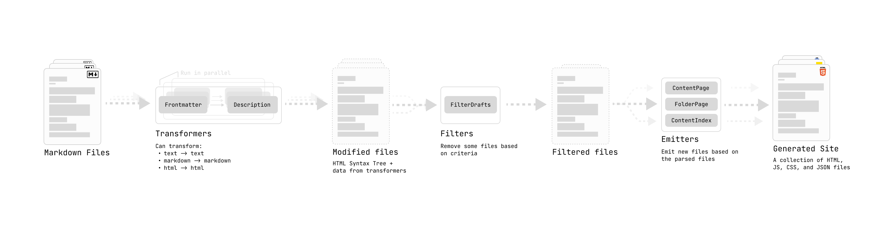

# Q4. 플러그인 계약

> 판정: ✅ 통과 (리뷰 완료)

1. quartz/plugins/types.ts의 PluginTypes에 따르면 Quartz 플러그인은 몇 종류이며
각각의 이름은? (v5에서 추가된 종류가 무엇인지도 — v4 문서와 비교하거나 optional
여부로 추론) 

종류: 4종(QuartzTransformerPlugin, QuartzFilterPlugin, QuartzEmitterPlugin, QuartzPageTypePlugin)
v5에서 Page Type (QuartzPageTypePlugin) 이 추가되었습니다. 
```ts
export interface PluginTypes {
  transformers: QuartzTransformerPluginInstance[]
  filters: QuartzFilterPluginInstance[]
  emitters: QuartzEmitterPluginInstance[]
  pageTypes?: PageTypePluginEntry[]
}
```
플러그인은 Internal과 Community(quartz-community의 사용자가 직접 개발) 유형으로 나눌 수 있으며 Community 시스템이 v5에 도입되었습니다. 페이지 타입은 Optional 하며, 페이지 렌더링 방식을 정의합니다.
사용자가 다양한 유형의 페이지(컨텐츠, 리스트, 404 등)를 커스터마이징하기 위해 사용합니다.

플러그인은 타입을 여러개 가질 수 있습니다(상호배타적이지 않음)


2. 루트 plugins/에 있는 본인의 자작 플러그인 중 하나를 골라: 어느 종류에
속하며, 코어의 어떤 타입(들)을 import해서 계약을 만족시키는가? 

자작 플러그인 분석: section-privacy를 분석해봅시다(원본 소스: `plugins/section-privacy`, 설치 산출물: `.quartz/plugins/section-privacy`)

플러그인 레포지토리(로컬 혹은 gh repo)는 아래 구조로 구성됩니다.
`src/index.ts` — 플러그인 함수를 export 하기 위한 진입점
`tsup.config.ts` — tsup을 사용한 빌드 설정
`package.json` — `@quartz-community/types` 와 `@quartz-community/utils`패키지로의 의존성 선언


section-privacy의 타입은 transformer로, transformer는 마크다운 파일을 가져와 수정된 컨텐츠를 출력하거나 메타데이터를 추가하는 역할을 한다(여기서 섹션(section)이란 사이트에서 컨텐츠 카테고리를 나누어 표현(포스트, 데일리 등)하기 위해 추가한 필드이다).
section-privacy는 특정 섹션을 비공개하기 위해, 섹션의 필드 중 private: true인 경우, 빌드 시점에 해당 섹션에 속한 노트에 encrypted-pages 플러그인이 읽는 password frontmatter를 환경변수에서 주입한다.

모든 플러그인은 options(object | undefined) 단일 파라미터를 받는데(소스에는 opts라고 작성되었음), quartz.config.yaml 파싱 결과의 각 플러그인별 options의 내용이 담겨있다. 그리고 플러그인 타입에 상응하는 객체를 반환한다. 

> **리뷰 노트 (근거 보강)**: 팩토리 호출의 정확한 지점은 `config-loader.ts:465`
> `const options = { ...manifest?.defaultOptions, ...entry.options, ...pluginOverrides }`.
> 스프레드 순서가 우선순위다(기본값 < 사용자 YAML < 오버라이드). 병합 결과가 빈
> 객체면 `undefined`를 넘기므로 `(opts?: Options)` 시그니처와 정합. 전체 설정
> (`GlobalConfiguration`) 접근은 opts가 아니라 각 메서드의 `ctx: BuildCtx` 경유.
>
> 관찰(세션 02 출발 과제): 레이아웃 컴포넌트 인스턴스화 경로(:780)만
> `manifest?.defaultOptions`가 병합에서 빠져 있다. registry 내부에서 따로 처리하는
> 의도된 설계인지, #2511류의 경로 간 불일치인지 `componentRegistry.instantiate`
> 확인 필요.

[Transformers](https://quartz.jzhao.xyz/advanced/making-plugins#:~:text=that%20displays%20it-,Transformers,-Transformers%20map%20over) 플러그인을 위한 type 정의는 아래와 같다.
```ts
export type QuartzTransformerPluginInstance = {
  name: string
  textTransform?: (ctx: BuildCtx, src: string) => string
  markdownPlugins?: (ctx: BuildCtx) => PluggableList
  htmlPlugins?: (ctx: BuildCtx) => PluggableList
  externalResources?: (ctx: BuildCtx) => Partial<StaticResources>
}
```
그리고 sections-privacy가 return하는 객체는 이 모양을 충족시켜야하며, name, markdownPlugins만 구현이 되어있다.
markdownPlugins에는 [remark](https://github.com/remarkjs/remark/blob/main/doc/plugins.md)(구조적으로 마크다운 to 마크다운으로 변환하기 위한 도구) 플러그인 리스트를 정의한다.
그 외에 rehype(html to html 변환), textTransform(text to text 변환), externalResources(플러그인이 제대로 작동하기 위해 클라이언트 사이드에서 로드해야하는 외부 리소스) 등이 있다.

markdownPlugins 필드에 하나의 플러그인 함수가 작성되어있다.
파일의 slug를 확인해서, 해당 섹션이 가져야 할 prefix가 파일 경로에 포함될 경우 프론트매터에 환경변수로부터 읽은 패스워드를 추가해준다. 그리고 섹션의 인덱스노트에 자식 노트 목록이 바로 드러나지 않게 암호화 시킨다.
## 부록: quartz/plugins/types.ts vs @quartz-community/types — 왜 같은 인터페이스가 두 벌인가 (튜터 문답 요약)

**용도 차이**: Quartz 코어는 `private: true`라 npm에 발행되지 않는다(클론 배포).
별도 저장소에서 개발되는 커뮤니티 플러그인은 코어의 타입 파일을 import할 방법이
없으므로, 계약만 추출해 발행한 것이 `@quartz-community/types`다.

| | quartz/plugins/types.ts | @quartz-community/types |
|---|---|---|
| 소비자 | 코어 자신 | 외부 플러그인 개발자 |
| 존재 형태 | 클론된 저장소의 소스 | npm 발행 패키지 |

devDependencies에 두는 이유: 타입은 컴파일 시에만 쓰이고 런타임 산출물에 남지 않음.

**두 벌이 호환되는 원리**: 구조적 타이핑(types S3). 플러그인은 패키지 사본으로
컴파일되고 코어는 자기 사본으로 다루지만, 모양이 같으면 출처가 달라도 호환된다.
Java(명목적)라면 공유 -api 아티팩트 없이 불가능한 구조. Go의 "소비자가 인터페이스를
재선언하는" 관행과 같은 메커니즘.

**드리프트 위험 (이 세션의 세 번째 사례 후보)**: utils는 코어가 패키지를
재export하는 단일 소스(quartz/util/path.ts:1)인데, types는 코어가 독립 정의한
사본 2벌(코어 types.ts에 @quartz-community import 없음 확인). 코어 계약이 바뀌고
패키지 발행이 늦으면 플러그인은 구계약으로 컴파일 통과하고, 코어의 플러그인 로딩은
동적 import라 타입 검사가 없으므로 어긋남은 런타임에서 발현된다.
types만 사본인 이유(추정, 미검증): 코어 types.ts가 BuildCtx, QuartzComponent 등
코어 내부 타입에 의존해 통째로 추출이 어려움. 두 사본의 현재 일치 여부 diff 확인은
세션 02 과제.
